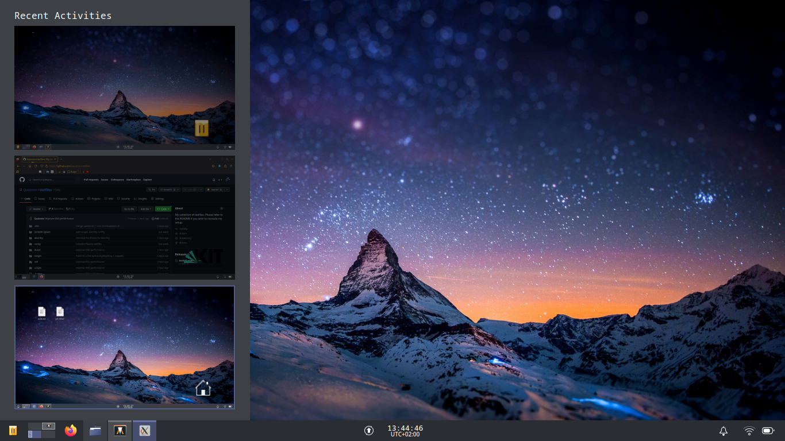

# mobile-Arch/Plasma

KDE/Plasma running on Archlinux. I use this setup on my notebook and an very happy with it. Not all configurations are listed in the dotfiles, as they can easily be setup via Plasma system settings. For the most part, the configurations in here are rather standard. Focus is on separating work from other things using Activities. Some noteable changes/features include:

* Activity switcher using conky and rofi. I wasn't happy with the look/performance of the builtin version, so I made my own one. This one feels a bit faster, has more natural handling, and comes with a .
* Custom notifications using dunst, as well as a systray-style notification applet with a minimal selection of features.
* Heavily streamlined workflow for writing LaTeX documents in vim. I'm using UltiSnippets for text completion as well as a custom syntax file for everything tex.

\+ more minor changes that help with my personal workflow. Feel free to contact me/raise an issue if you have any questions.